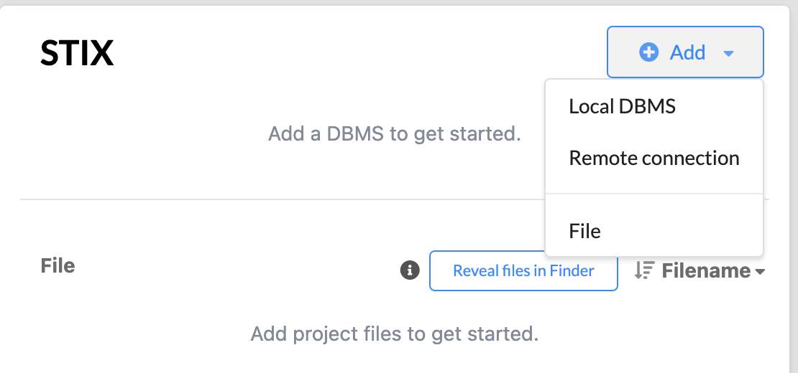
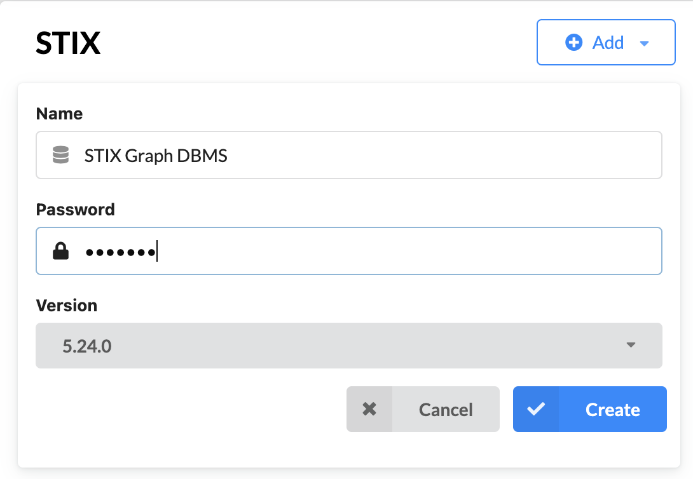
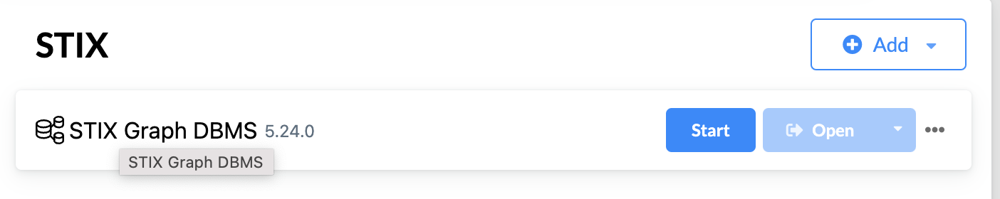
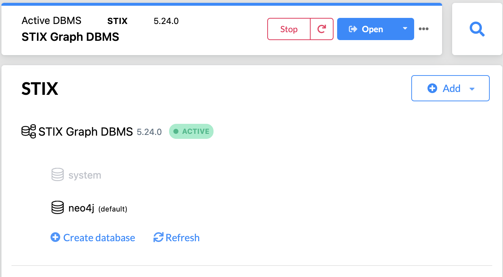
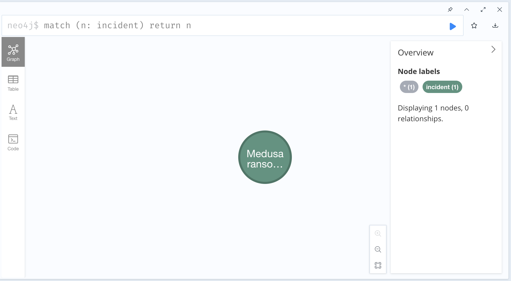
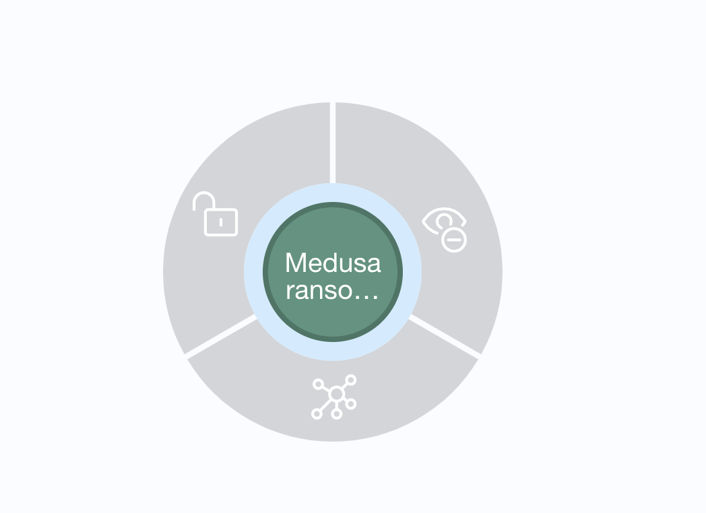
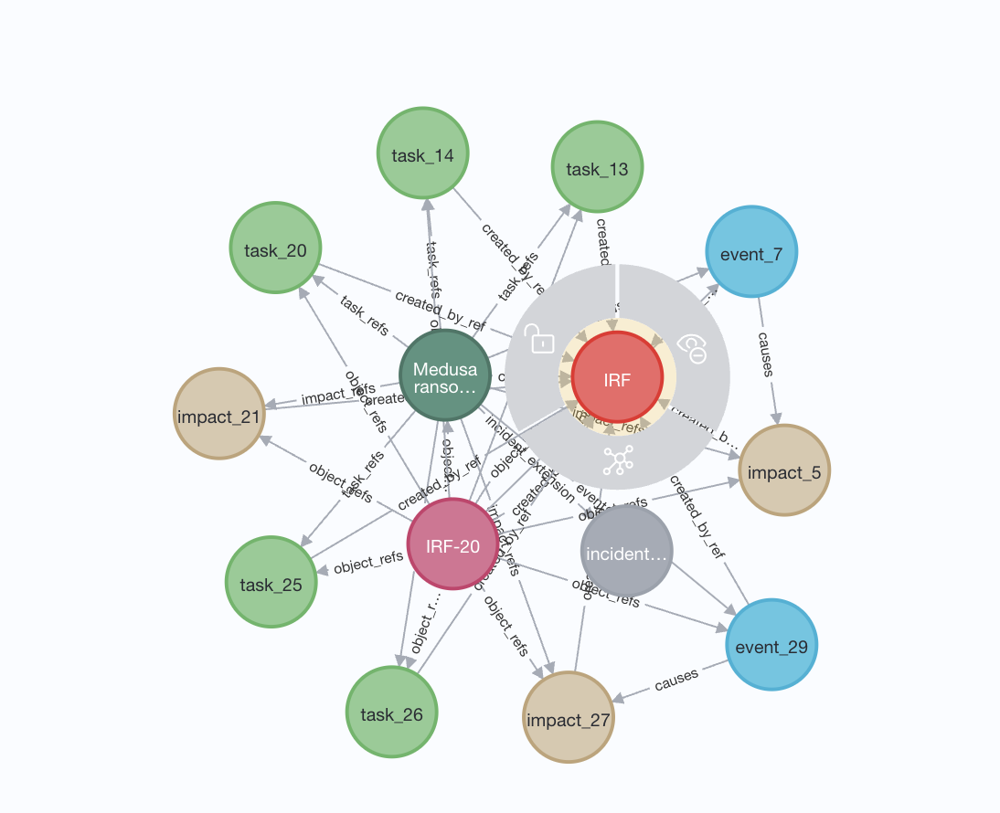
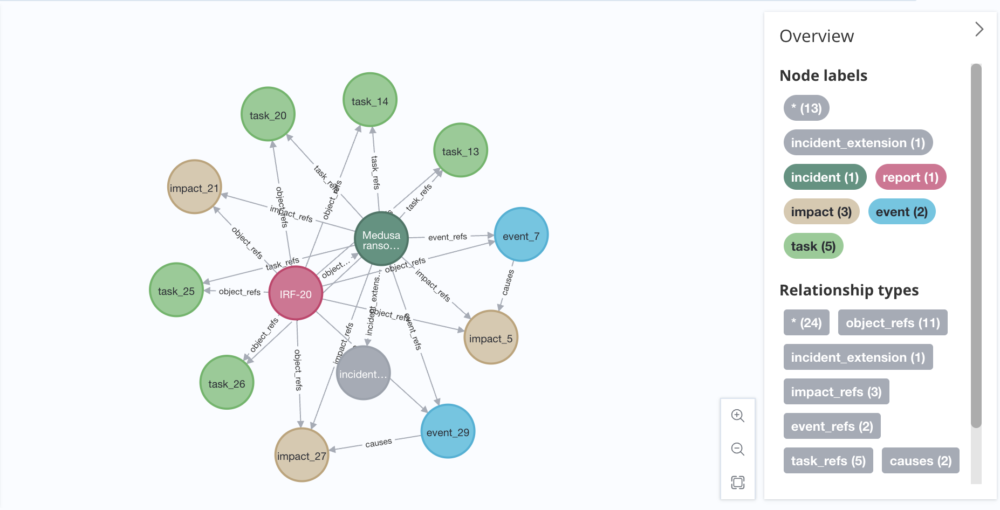
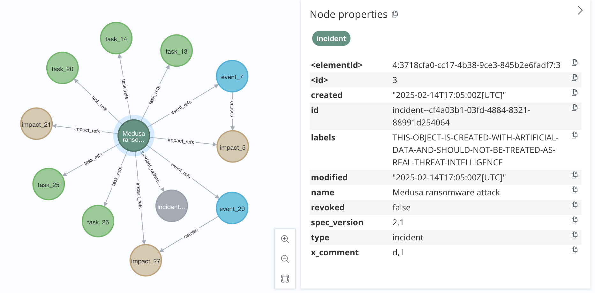

# Experimenting with the Neo4j graph database Python STIX DataStore

The Neo4j graph database Python STIX DataStore is a proof-of-concept implementation to show how to store STIX content in a graph database. 

## Limitations:

As a proof-of-concept it has minimal functionality.  
 
## Installing Neo4j

See https://neo4j.com/docs/desktop-manual/current/installation

This will install the neo4j desktop application, which contains the neo4j browser to view the database.

## Installing Neo4j python library

The python neo4j library used is py2neo, available in pypi at https://pypi.org/project/py2neo/.  Note this library is no longer being supported and has reached the "end-of-life". A different implementation of the DataStore could be written using https://neo4j.com/docs/api/python-driver/current/.

## Implementation Details

We would like to that the folks at JHU/APL for their implementation of [STIX2NEO4J.py](https://github.com/opencybersecurityalliance/oca-iob/tree/main/STIX2NEO4J%20Converter), which this code is based on.  

Only the DataSink (for storing STIX data) part of the DataStore object has been implemented.  The DataSource part is implemented as a stub.  However, the graph database can be queried using the neo4j cypher langauge within
the neo4j browser

The main concept behind any graphs are nodes and edges.  STIX data is similar as it contains relationship objects (SROs) and node objects (SDOs, SCOs and SMOs).  The division of data in STIX is a natural fit
into the Neo4j model.  Additional edges are provided by STIX embedded relationships, which are expressed as properties in node objects. 

The order in which STIX objects are added to the graph database is arbitrary. Therefore, when an SRO or embedded relationship is added via the DataStore, the nodes that it connects may not be present in the database, so the relationship is not added to the database, but remembered by the DataStore code as an unconnected relationship. Whenever a new node is 
added to the database, the unconnected relationships must be reviewed to determine if both nodes of a relationship can now be represented using an edge in the graph database.  

Note that unless both the source and target nodes are eventually added, 
the relationship will not be added either.  
How to address this issue in the implementation has not been determined.

## Demonstrating a neo4j database for STIX

Open the neo4j desktop app create a new project named STIX.

Select local DBMS on your local machine.

Create the database.

Start the database.

python demo.py \<STIX bundle file\> is used populate a local neo4j database which can be viewed using the neo4j browser.
A sample bundle file bundle--21531315-283d-4604-8501-4b7166e58c84.json is provided in the docs directory.

Open the neo4j browser to view the database.

Query using the cypher language.

Clicking left on a node, gives you a choice of adding all related nodes and edges, removing the node and its edges from the display, or locking the node position.

Remove the report object node for a better view of the graph.

Explore the graph.

View the node properties, by mousing on any node.

